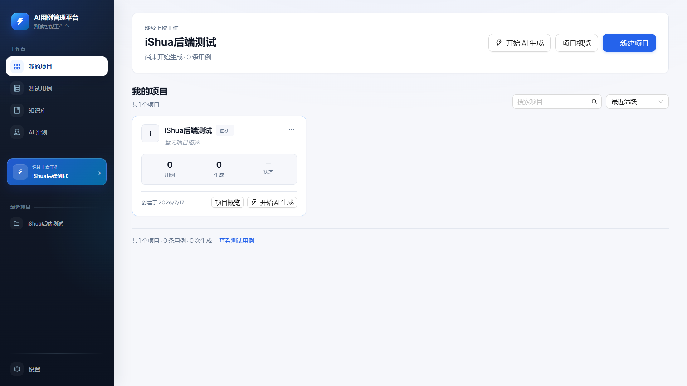
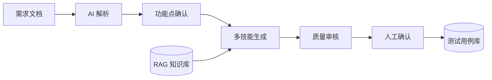

<div align="center">

# AI TestCase Manager

### 从需求文档到高质量测试用例，让 AI 参与测试设计的完整工作流

上传 Word / Markdown，或直接粘贴需求文本；系统会自动解析功能点、生成测试用例、执行质量审核，并通过人工确认完成入库。

<p>
  <a href="https://github.com/C1ouDreamW/ai-testcase-manager/actions/workflows/ci.yml"></a>
  <a href="https://www.python.org/"></a>
  <a href="https://react.dev/"></a>
  <a href="https://fastapi.tiangolo.com/"></a>
  <a href="https://vite.dev/"></a>
  <a href="https://www.sqlite.org/"></a>
  <a href="https://playwright.dev/"></a>
</p>

[快速开始](#快速开始) · [核心能力](#核心能力) · [技术架构](#技术架构) · [自动化测试](#自动化测试)



</div>

---

## 项目特性

| AI 驱动 | 质量可控 | 灵活扩展 | 工程可靠 |
| :---: | :---: | :---: | :---: |
| 从 PRD 自动提取功能点并生成用例 | 规则检查、重复检测、AI 评分与幻觉检测 | 插件式 Skill 与 OpenAI 兼容接口 | 94 条 API / UI 自动化测试 |
| RAG 注入业务知识，减少上下文缺失 | 草稿审核机制保留人工决策 | 生成、评测、嵌入模型独立配置 | 独立测试环境与 CI 持续验证 |

## 工作流程



1. **导入需求**：上传 Word / Markdown，或直接粘贴需求文本。
2. **确认范围**：AI 将需求拆解为结构化功能点，由测试人员确认。
3. **生成用例**：选择完整覆盖或快速冒烟策略，按需启用专项 Skill。
4. **审核质量**：执行规则检查、重复检测、AI 评分与幻觉检测。
5. **人工入库**：逐条采纳、拒绝或编辑，将确认后的用例沉淀到用例库。

## 核心能力

### AI 用例生成

- 自动解析需求，输出结构化功能列表
- 支持完整覆盖与快速冒烟两种生成策略
- 支持接口测试、安全与权限等专项用例
- 生成结果以草稿呈现，可逐条采纳、拒绝和编辑

### RAG 知识库

- 上传业务文档并通过 ChromaDB 完成向量化
- 生成时语义检索相关知识并注入 Prompt
- 支持 Mock 模式，无需真实模型即可体验核心流程

### 质量审核与离线评测

- 规则检查 → 重复检测 → AI 多维评分 → 幻觉检测 → 聚合报告
- 基于需求与人工黄金检查点创建评测样本
- 统计成功率、可用率、召回率、重复率和幻觉数
- 支持多轮评测结果对比，量化模型与 Prompt 的改进效果

### 插件式 Skill 系统

每个 Skill 由 `skill.yaml`、`handler.py` 和 `prompt.md` 组成，系统会自动发现并调度。

| Skill | 类型 | 作用 |
| --- | --- | --- |
| `requirement_parser` | 核心 | 将 PRD 解析为结构化功能列表 |
| `case_writer` | 核心 | 按功能点生成测试用例 |
| `case_judge` | 质量 | AI 评分与幻觉检测 |
| `test_proposal` | 工具 | 输出测试范围与风险建议 |
| `api_test` | 专项 | 生成接口测试用例 |
| `security` | 专项 | 生成安全与权限测试用例 |

## 快速开始

### 环境要求

- Python 3.12+
- [uv](https://docs.astral.sh/uv/)
- Node.js 22+

### 1. 准备配置

```bash
cp .env.example .env
```

默认已开启 `LLM_MOCK_MODE=true`，无需配置 API Key 即可体验。接入真实模型时，请在 `.env` 中填写对应的 OpenAI 兼容接口配置。

### 2. 启动后端

```bash
cd backend
uv sync
uv run uvicorn app.main:app --reload --port 8000
```

### 3. 启动前端

```bash
cd frontend
npm install
npm run dev
```

启动完成后访问：

- Web 应用：<http://localhost:5173>
- API 文档：<http://localhost:8000/docs>

> 前端会自动将 `/api` 请求代理到本地后端。

## 技术架构

| 层级 | 技术选型 |
| --- | --- |
| 前端 | React 19、Ant Design 6、Vite 8、Axios |
| 后端 | FastAPI、Pydantic v2、SQLAlchemy 2.0 |
| 数据 | SQLite、ChromaDB |
| AI | OpenAI Compatible API、可插拔 Skill、RAG |
| 测试 | pytest、Playwright、Allure |
| 工程化 | uv、Ruff、GitHub Actions |

<details>
<summary><strong>查看项目结构</strong></summary>

```text
ai-testcase-manager/
├── backend/
│   └── app/
│       ├── api/          # API 路由
│       ├── models/       # 数据模型
│       ├── schemas/      # 请求与响应模型
│       ├── services/     # 生成、评测、RAG 与质量检查
│       └── skills/       # 插件式 AI Skill
├── frontend/             # React Web 应用与五步生成向导
├── autotest/             # API / UI 自动化测试与 Allure 报告
├── .github/workflows/    # CI 工作流
└── .env.example          # 环境变量示例
```

</details>

## 自动化测试

项目内置独立自动化测试工程。测试使用隔离的 SQLite、ChromaDB 和 LLM Mock 环境，不会污染本地开发数据。

| 测试类型 | 数量 | 覆盖范围 |
| --- | ---: | --- |
| API 自动化 | 74 条 | 健康检查、项目、需求、功能清单、生成、评审、知识库等 |
| UI 自动化 | 20 条 | 导航、项目管理、五步生成、用例库、知识库、设置等 |
| **合计** | **94 条** | **核心接口与用户旅程** |

```bash
cd autotest

./run_tests.sh api      # API 测试
./run_tests.sh ui       # UI 测试
./run_tests.sh smoke    # 冒烟测试
./run_tests.sh all      # 全量测试
```

Windows 请使用 `run_tests.bat`，参数与上面一致。测试结果可通过 Allure 生成可视化报告，也可以[查看完整自动化测试报告](https://blog.csdn.net/m0_55168214/article/details/162934606)。

---

<div align="center">

如果这个项目对你有帮助，欢迎提交 Issue、Pull Request，或点亮一个 Star。

</div>
