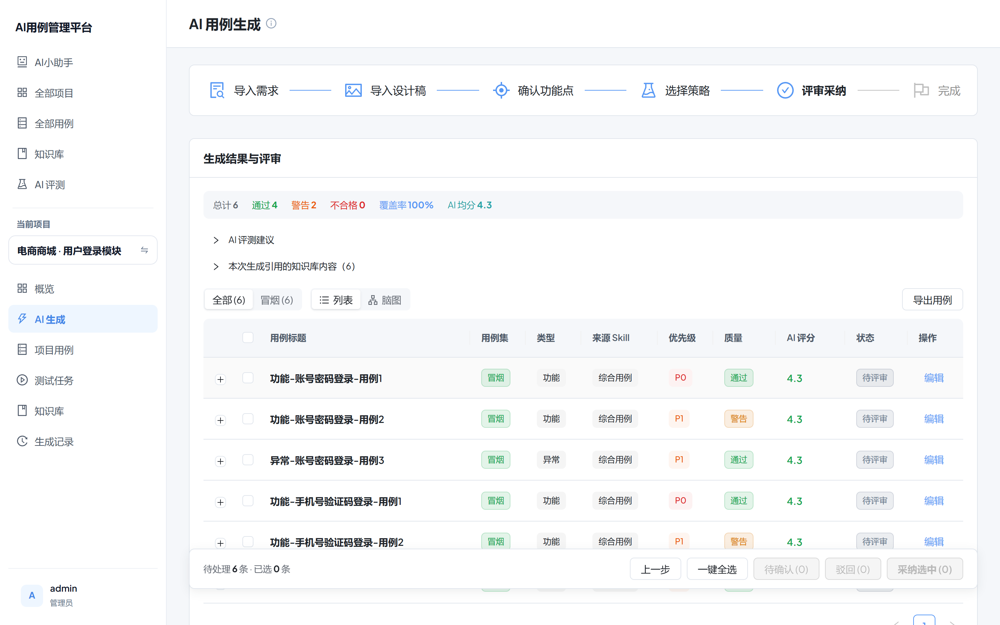
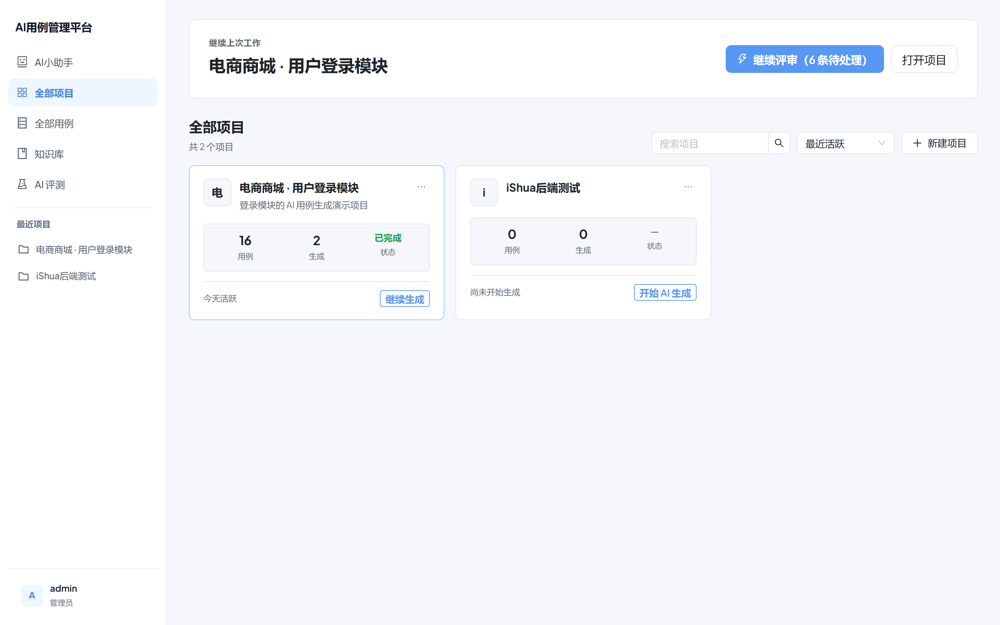
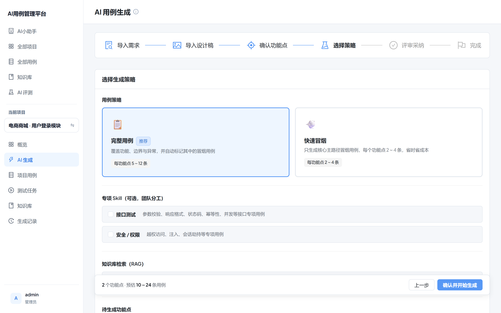
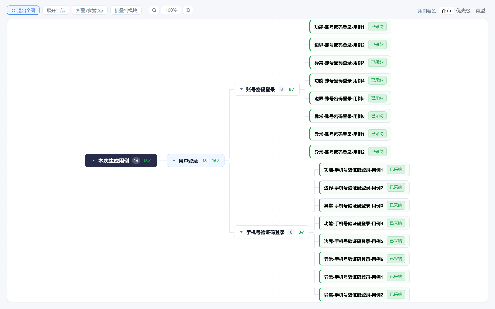
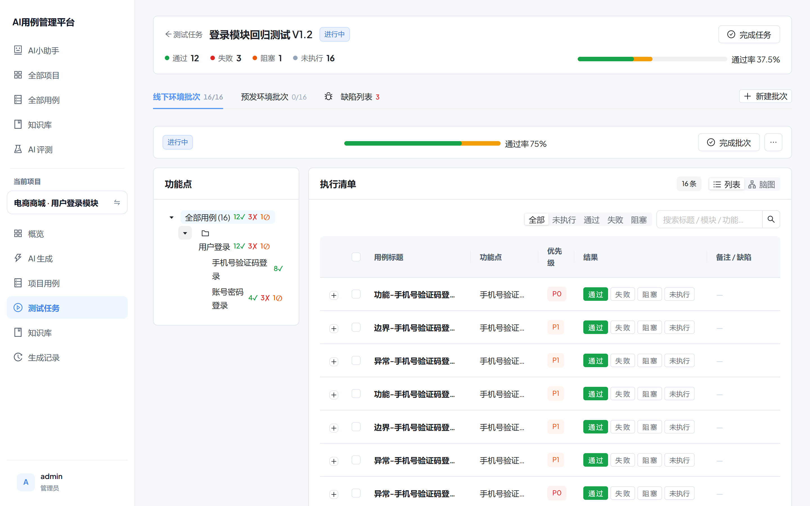
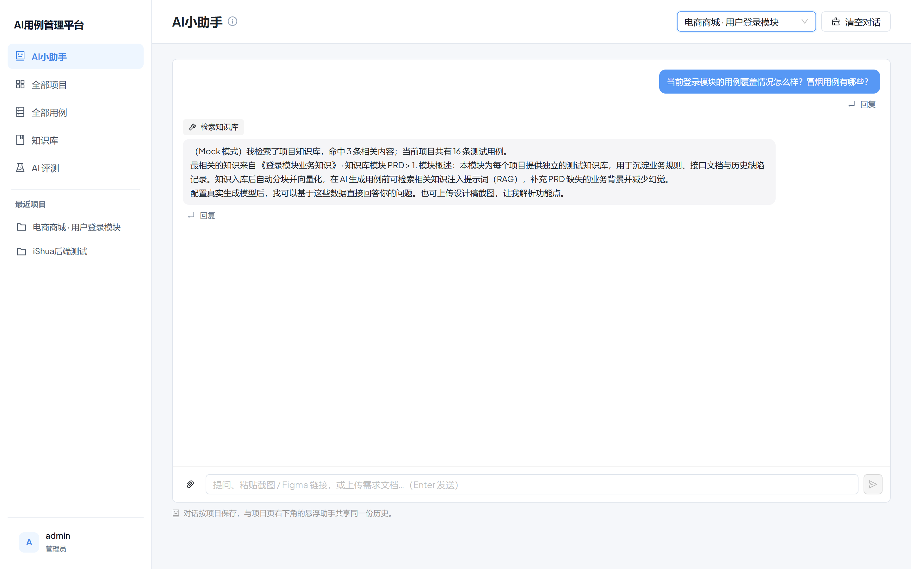
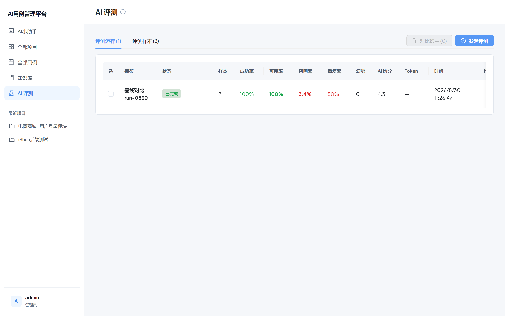

# AI 用例生成与管理系统（AITC）

[](https://github.com/C1ouDreamW/ai-testcase-manager/actions/workflows/ci.yml)

基于 LLM 的测试用例生成与管理平台，覆盖「需求导入 → 功能点拆解 → RAG 增强生成 → 质检评审 → 用例管理 → 执行回归 → AI 评测」完整闭环。支持 OpenAI 兼容模型（DeepSeek、通义、OpenAI 等），内置 Mock 模式，无 API Key 也可完整体验。



## 核心亮点

- **LangGraph 工作流编排**：生成主链路按功能点分节点执行，支持安全暂停、失败恢复（checkpoint 断点续跑），租约机制防止并发双跑
- **RAG 知识增强**：项目级知识库，Markdown 分块 + 向量化，混合检索（向量 + BM25 + RRF 融合，可选 Rerank 精排），按功能点召回业务规则注入生成 Prompt，降低幻觉
- **四层质量保障**：Prompt 约束 → 规则质检（格式 / 重复检测）→ AI Judge 评分与幻觉标记 → 人工评审采纳，入库才可用
- **AI 测试助手 Agent**：LangGraph ReAct 循环 + 只读工具集，自然语言查询用例覆盖、测试进度、缺陷与业务规则，SSE 流式输出工具调用过程
- **Skill 插件架构**：manifest + prompt + handler 的插件结构，完整用例 / 快速冒烟策略 + 安全、接口专项 Skill，新增 Skill 无需改前端
- **AI 评测体系**：评测样本 + 回归运行，量化生成成功率、可用率、场景召回率、重复率、幻觉数、Token 成本与耗时

## 界面速览

| 项目工作台 | 生成向导 |
|---|---|
|  |  |

| 用例脑图评审 | 测试任务执行 |
|---|---|
|  |  |

| AI 测试助手 | AI 评测 |
|---|---|
|  |  |

## 功能一览

- **需求导入**：粘贴文本 / 上传 Word、Markdown / 导入 FeatureList（xlsx、md）；可选上传设计稿截图，由视觉模型提取功能点后确认合并
- **功能点确认**：AI 解析 PRD 为结构化功能点（模块 / 描述 / 验收标准 / 优先级），支持行内编辑与测试范围（不测范围 / 风险）维护
- **用例生成**：完整用例（每功能点 5~12 条，覆盖功能 / 边界 / 异常，核心路径自动标冒烟）与快速冒烟（2~4 条）两种策略；生成结果支持列表 / 脑图双视图评审，导出 Excel / Markdown
- **用例管理**：全局测试用例库，按项目 / 模块 / 功能点浏览，列表与脑图双视图，目录与用例可编辑
- **测试任务**：任务 / 批次（线下、预发、线上）管理，执行结果标记（通过 / 失败 / 阻塞），通过率统计与缺陷列表
- **知识库**：项目级文档入库自动分块向量化，检索测试面板可验证召回效果（命中来源：语义 / 关键词 / 双路）
- **账号体系**：登录注册（可关闭）、会话锁定与频控、管理员与普通用户，模型配置按用户隔离

## 技术栈

| 层 | 技术 |
|---|---|
| 后端 | FastAPI + SQLAlchemy + SQLite（可切换 PostgreSQL） |
| 前端 | React 19 + Vite + Ant Design |
| AI 编排 | LangChain（模型适配 / 结构化输出）+ LangGraph（工作流 / ReAct Agent / Checkpoint） |
| 检索 | OpenAIEmbeddings + Chroma + BM25（jieba）+ RRF 融合 |
| 自动化测试 | pytest + requests（接口）+ Playwright + POM（UI） |

## 快速开始

环境要求：Python 3.12+ 与 [uv](https://docs.astral.sh/uv/)、Node.js 22+。

```bash
cp .env.example .env   # 不配置 LLM_API_KEY 时自动使用 Mock 模式，可完整体验全流程

# 后端（http://localhost:8000）
cd backend && uv sync --all-groups
uv run uvicorn app.main:app --reload --port 8000

# 前端（http://localhost:5173）
cd frontend && npm install && npm run dev
```

或使用一键脚本：`./restart.sh`（macOS / Linux），Windows 双击 `setup.bat` 后运行 `start.bat`。

首次访问用默认管理员登录：`admin / nini123456`（见 `.env` 的 `AUTH_USERNAME` / `AUTH_PASSWORD`，建议修改）。

- 前端地址：http://localhost:5173
- Swagger 文档：http://localhost:8000/docs

## 自动化测试

测试工程位于 [`autotest/`](autotest/README.md)，使用隔离的临时数据库与 Mock 模式运行，不污染开发数据；后端另有 37 条单元测试（`backend/tests`）。GitHub Actions 每次 push / PR 自动执行 ruff 检查、后端单元测试、前端构建与接口自动化回归。

```bash
cd autotest
./run_tests.sh api     # 86 条接口自动化
./run_tests.sh ui      # 21 条 UI 自动化（Playwright + POM）
./run_tests.sh all     # 全量，报告输出到 reports/
```

## 目录结构

```
aitc/
├── backend/app/       # api / models / services / ai / agent / skills / workflows
├── frontend/src/      # pages / components / layouts / services
├── autotest/          # 接口自动化 + UI 自动化 + 报告
├── docs/              # PRD、接口文档、评测数据
├── democase/          # 示例需求与知识文档
└── assets/            # README 截图
```

## 相关文档

- [产品需求（PRD）](docs/PRD.md)
- [接口文档](docs/接口文档.md)
- [本地环境准备](docs/环境准备.md)
- [评测样本说明](docs/评测数据/)
